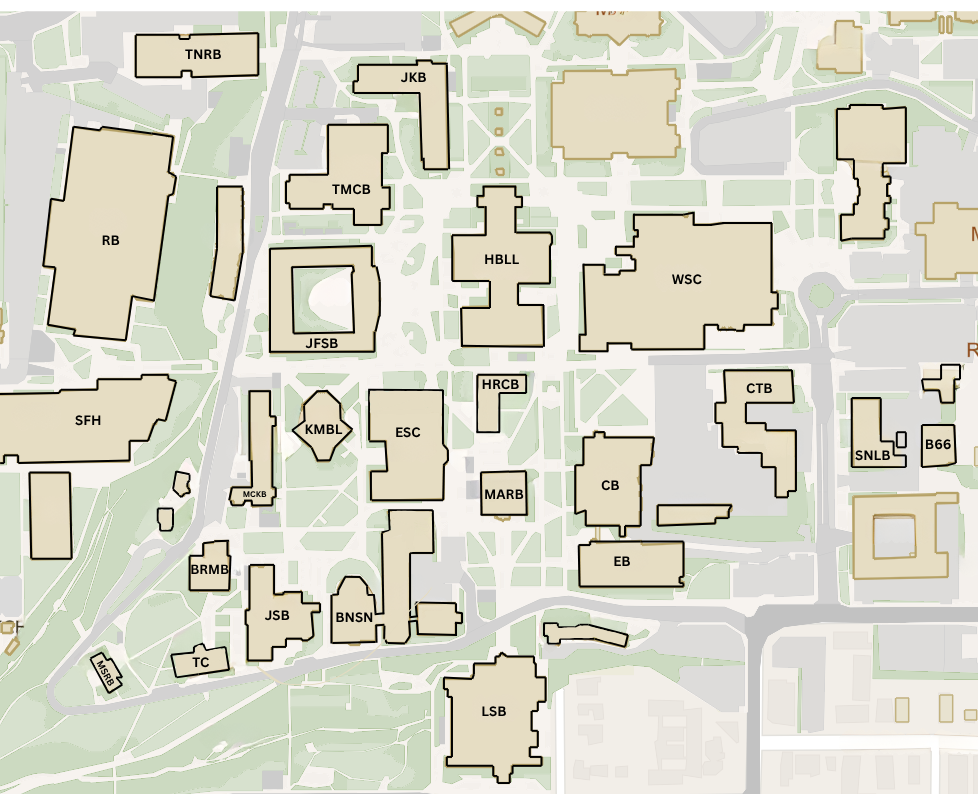

# Fall 2025 NSO Mentor Website

This repository contains the **Fall 2025 New Student Orientation (NSO) Mentor Website** for BYU First-Year Experience.  
It is designed for **mentors**, **coordinators**, and **supervisors** to quickly access maps, schedules, room assignments, help videos, and restricted supervisor resources.

The site is fully **static** — HTML, CSS, and JavaScript only — no backend server.  
Everything is stored locally in the repo.

---

## 📂 File Structure

```
/
├── home.html
├── index.html
├── schedule.html
├── rooms.html
├── help.html
├── login.html
├── supervisor.html
├── css/
│   └── styles.css
├── js/
│   └── main.js
├── /images
│   ├── updatedmap.png        # Main campus map used on maps.html
|   ├── yphoto2.jpeg          # Background image used on home.html
│   ├── spot-1.jpeg           # Preview and detail image for spot 1
│   ├── spot-2.jpeg
│   ├── spot-3.jpeg
│   ├── ...                   # Continue through spot-183.jpeg (1:1 with spot IDs)
│   └── (any additional static assets/icons you add)
├── pdfs/
│   └── Fall 2025 NSO Student Schedule.pdf
└── README.md
```

---

## 🖥 Page-by-Page Documentation

---

### **home.html** – Site Landing Page
**Purpose:**  
Acts as the main entry point for the NSO mentor website. Links to all major pages in the navigation bar.

**Key Features:**
- Navigation bar (`#top-nav`) links to:
  - Home
  - Schedule
  - Mentor Maps
  - Mentor Assignments
  - Help Videos
  - Login
- Uses shared styles from `styles.css`.

**Maintenance:**
- Update links here if new main pages are added.
- Keep the navigation bar consistent with other pages.

---

### **maps.html** – Mentor Maps
**Purpose:**  
Displays a clickable BYU campus map with mentor meeting spots.

**Key Features:**
- Each spot is a `<a>` element with:
  - `id="spot-N"`
  - `class="map-spot"`
  - Inline `style="top: Xpx; left: Xpx;"`
  - `data-group="colorName"` for supervisor group color.
- Color codes:
  - `pink` → deeppink  
  - `yellow` → gold  
  - `green` → limegreen  
  - `blue` → royalblue  
  - `black` → darkviolet  
  - `purple` → darkviolet  
  - `orange` → darkorange
- Hovering (desktop only) shows `.image-preview` for that spot.

**Spot & Preview Pairing:**
- Must have matching IDs:
  - `spot-5` ↔ `preview-5`
- Previews contain:
  ```html
  <div class="image-preview" id="preview-N">
    
    <p>Description text</p>
  </div>
  ```

**Mobile Behavior:**
- Spots are smaller.
- Previews disabled for touch navigation.

**Maintenance:**
- To add a spot:
  1. Create the `.map-spot` link.
  2. Add a matching `.image-preview`.
  3. Update spot count in `main.js` if adding beyond 183.
- To change colors: Edit `styles.css` data-group selectors.

---

### **schedule.html** – Mentor Schedule
**Purpose:**  
Shows detailed work schedules for Thursday, Friday, and Tuesday of NSO week.

**Structure:**
- Separate `<table>` for each day.
- Times, events, and dress notes listed.
- No special table styling — browser defaults are used.

**Maintenance:**
- Edit events directly in `<td>` cells.
- Keep structure consistent for each day.

---

### **assignments.html** – Mentor Room Assignments
**Purpose:**  
Lists mentor names with their assigned NSO meeting rooms.

**Structure:**
- `<table>` with columns for:
  - Mentor Name
  - Room 
  - Spot Number
  - Color Number
- Can be easily updated by adding/removing `<tr>` rows.

---

### **help.html** – Training Videos
**Purpose:**  
Hosts extra training videos for mentors.

**Layout:**
- `.video-grid` uses CSS grid for responsive layout.
- Each video block:
  ```html
  <div class="video-block">
    <p>Video Title</p>
    <iframe src="https://www.youtube.com/embed/ID" allowfullscreen></iframe>
  </div>
  ```

**Maintenance:**
- To add a video:
  1. Copy an existing `.video-block`.
  2. Change `<p>` to new title.
  3. Replace `src` with new YouTube embed link (`https://www.youtube.com/embed/...`).

---

### **login.html** – Coordinator/Supervisor Login
**Purpose:**  
Restricts access to `supervisor.html`.

**Functionality:**
- Password hardcoded as `byu150` in:
  ```js
  const correctPassword = "byu150";
  ```
- If correct:
  - Saves `authenticated=true` and `loginTime` in `localStorage`.
  - Redirects to last visited page (`sessionStorage.returnPage`).
- Expires after **10 minutes** of inactivity.

**Security Note:**
- Password is stored in plain text — not secure for sensitive data.

**Maintenance:**
- Change password by editing `correctPassword`.

---

### **supervisor.html** – Restricted Page
**Purpose:**  
Coordinator & supervisor-only resources.

**Access Control:**
- Only visible in navigation if `isLoggedIn()` returns true.
- Linked in from login logic in other pages.

---

## 🎨 Styling – `css/styles.css`

**Main Roles:**
- Global font, background, and text color.
- Navigation bar styles (`#top-nav`).
- Map spot size, hover scaling, and group colors.
- Image preview styling.
- Mobile adjustments for smaller screens.
- Footer styling.

**Legend:**
- Sidebar with color circles matches `data-group` values.

**Mobile Optimizations:**
- Hides legend and previews.
- Shrinks `.map-spot` to 4px.

---

## ⚙️ Scripts – `js/main.js`

**Features:**
1. **Spot/Preview Hover System**
   - Loops IDs `spot-1` to `spot-183`.
   - On desktop hover:
     - Shows preview near spot.
     - Raises spot z-index.
   - On mouse leave:
     - Hides preview.
     - Resets z-index.

2. **Legend Toggle**
   - `#legend-toggle` button shows/hides `#legend` (if present).

**Maintenance:**
- If adding spots > 183, change:
  ```js
  for (let i = 1; i <= 183; i++)
  ```
- Match spot and preview IDs exactly.

---

## 📄 PDFs

**Fall 2025 NSO Student Schedule.pdf**
- Official student-facing NSO schedule.
- Located in `/pdfs` folder.
- Can be linked or embedded in other pages.

---

## 🛠 Common Tasks for Future Editors

### Adding a New Map Spot
1. Add `.map-spot` `<a>` tag in `index.html`.
2. Position with `top`/`left` inline styles.
3. Set `data-group` for color.
4. Add matching `.image-preview`.

### Updating the Login Password
- Change the `correctPassword` variable in `login.html`.

### Adding Training Videos
- Edit `help.html` and insert a new `.video-block` with YouTube embed link.

### Updating Schedules or Room Assignments
- Directly edit `<table>` entries in `schedule.html` or `rooms.html`.

---

## 📌 Known Limitations
- **Password is public** in HTML source.
- **Map spots are hardcoded** — must be manually repositioned for a new map image.
- **No backend** — all edits are manual in HTML/CSS/JS.

---

---

## Images & Asset Management

### Folder
All images live in `/images`.

- `updatedmap.png` — the background map on `maps.html`
- `yphoto2.jpeg` - the background photo on `home.html`
- `spot-<ID>.jpeg` — preview + detail images for each spot, where `<ID>` is 1–183 (e.g., `spot-42.jpeg`)
- You can keep extra icons/assets here as needed.

### How images are referenced

- **Map**: `index.html` uses `/images/updatedmap.png`

```html


## 🚀 Deployment Steps
1. Upload all files/folders to your hosting environment.
2. Keep folder structure intact.
3. Test all links and hover features.
4. Verify mobile view on different devices.
